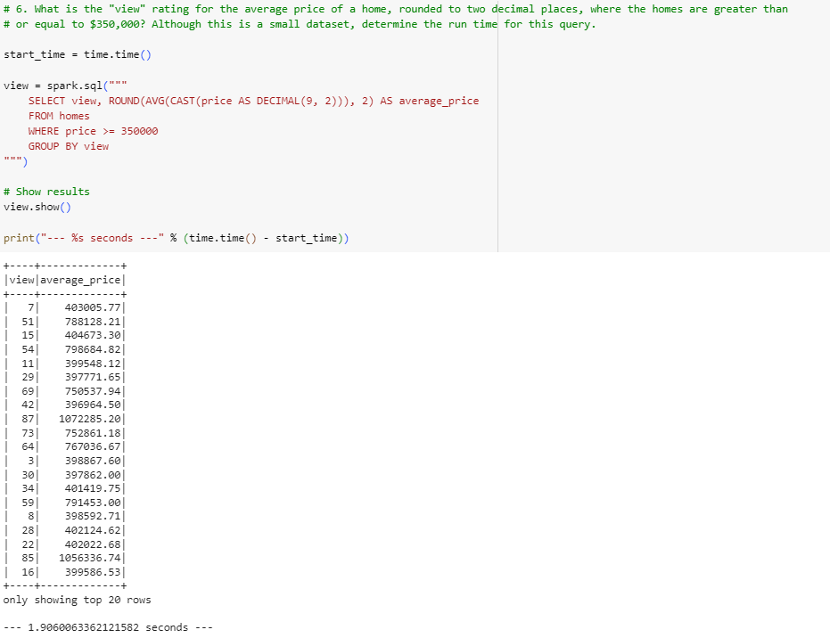

# Home_Sales

For this challenge, the task was to determine key metrics about home sales data. Spark is to be used to create temporary views, partition the data, cache and uncache a temporary table, and verify that the table has been uncached.

For this project, the aim is to answer the following questions:

#### What is the average price for a four-bedroom house sold for each year?
• To answer this question, we will calculate the average price of four-bedroom houses sold for each year in the dataset.

#### What is the average price of a home for each year it was built that has three bedrooms and three bathrooms?
• To address this question, we will to calculate the average price of homes for each year they were built, specifically considering those with three bedrooms and three bathrooms.

#### What is the average price of a home for each year that has three bedrooms, three bathrooms, two floors, and is greater than or equal to 2,000 square feet?
• We will find the average price of homes for each year that meet the following criteria: having three bedrooms, three bathrooms, two floors, and a total square footage of 2,000 or more.

#### What is the "view" rating for homes costing more than or equal to $350,000?
• In this part, we will to determine the "view" rating of homes that cost more than or equal to $350,000. Additionally, we will measure the runtime of the query to assess its efficiency.

For the query involving homes with a price of $350,000 or more, we also ran the query using a cached table, which resulted in faster load times, as shown below:

To optimize the performance further, we made a partition on the "date_built" column, resulting in the creation of a temporary table named "temp_home_sales_data." The same query was then executed using this parquet dataframe, as illustrated below:

